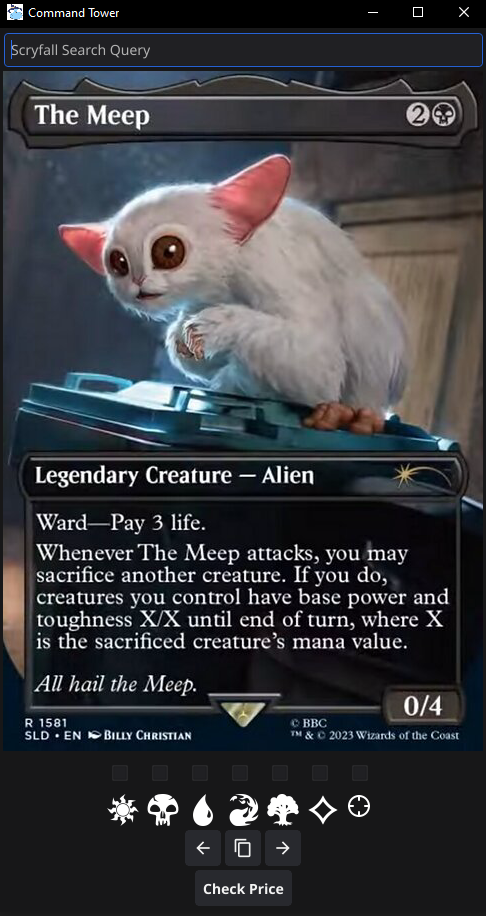

<!-- PROJECT SHIELDS -->
<!--
*** I'm using markdown "reference style" links for readability.
*** Reference links are enclosed in brackets [ ] instead of parentheses ( ).
*** See the bottom of this document for the declaration of the reference variables
*** for contributors-url, forks-url, etc. This is an optional, concise syntax you may use.
*** https://www.markdownguide.org/basic-syntax/#reference-style-links
-->
[![Contributors][contributors-shield]][contributors-url]
[![Forks][forks-shield]][forks-url]
[![Stargazers][stars-shield]][stars-url]
[![Issues][issues-shield]][issues-url]
[![MIT License][license-shield]][license-url]

<!-- PROJECT LOGO -->
 

  

<h3 align="center">Command Tower</h3>

  

    A small tool for Magic:The Gathering players that fetches commanders for EDH as well as an average deck list for them.
  

<!-- TABLE OF CONTENTS -->

  
Table of Contents

  <ol>
    <li><a href="#about-the-project">About The Project</a></li>
    <li><a href="#installation">Installation</a></li>
    <li><a href="#usage">Usage</a></li>
    <li><a href="#roadmap">Roadmap</a></li>
    <li><a href="#license">License</a></li>
    <li><a href="#acknowledgments">Acknowledgments</a></li>
  </ol>

<!-- ABOUT THE PROJECT -->
## About The Project

(<a href="#readme-top">back to top</a>)

<!-- GETTING STARTED -->
## Getting Started

This is an example of how you may give instructions on setting up your project locally.
To get a local copy up and running follow these simple example steps.

### Installation

1. Go to the the releases page of this repository and download the CommandTower_win.exe file of the latest release
   [Here] https://github.com/piwonka/commandtower/releases
2. Run the file
   
Note:
A Windows prompt will notify you that the start of the Application was stopped due to Microsoft Defender SmartScreen.
This is because the .exe is not signed and Windows flags all unsigned .exe/.msi files as potentially malicious.

By Pressing: "More Information" -> "Run Anyways" you can circumvent this.

(<a href="#readme-top">back to top</a>)

<!-- USAGE EXAMPLES -->
## Usage

Here is a quick rundown of the UI elements:
* "Scyfall Search Query" is a TextField where you can enter specific search queries for names, types
  * The search syntax is equal to the [Scryfall syntax](https://scryfall.com/docs/syntax)
  * Note: entering a color query here should be avoided, i havent tested how it behaves in combination with the color checkboxes
* Card Image
  * The randomly generated commanders will be displayed here, if the commander has no valid deck or the query ran into an error a placeholder cardback will be displayed
* Color checkboxes (In Order: White, Black, Blue, Red, Green, Colorless, Exact)
  * the generated commanders will be generated based on the color selection. Example: If white and black are selected, the generated commanders will be either white, black or orzhov (WB)
  * the rightmost "Exact"-icon forces an exact match of the colors, so for the same example: white and black are checked AND the last checkbox is checked aswell -> all resulting commanders will be WB
* Buttons
  * Back (<-)
    * goes back to the last commander, if present
  * Copy
    * copies the currently displayed commander's average decklist
    * the formate is:    <amount> <Cardname> \n ...
  * Next (->)
    * retrieves a new commander for the given query and color selection
* Price
  * Displays a price estimate for the deck in Euro ( might add $ toggle in the future, sorry non-europeans :) ) this is generally lowballed, since it checks for the cheapest possible price of the newest print of each card in the deck.

(<a href="#readme-top">back to top</a>)

<!-- ROADMAP -->
## Roadmap
- [ ] Edge Case Handling
  - [ ] Correct Usage of Partner Commanders
  - [ ] Correct Usage of Background
  - [ ] Correct Usage of Companions
- [ ] Performance Optimizations
  - [ ] Parallel Requests
  - [ ] Persistent Caching

See the [open issues](https://github.com/piwonka/commandtower/issues) for a full list of proposed features (and known issues).

(<a href="#readme-top">back to top</a>)

<!-- LICENSE -->
## License

Distributed under the GPL-3.0 License. See `LICENSE.txt` for more information.

(<a href="#readme-top">back to top</a>)

<!-- ACKNOWLEDGMENTS -->
## Acknowledgments
Icons for this Project have been kindly provided by:
* Renee French [BlogSpot](http://reneefrench.blogspot.com/) [GitHub](https://github.com/egonelbre/gophers/)
* Andrew Gioia [GitHub](https://github.com/andrewgioia/Mana)

(<a href="#readme-top">back to top</a>)

<!-- MARKDOWN LINKS & IMAGES -->
<!-- https://www.markdownguide.org/basic-syntax/#reference-style-links -->
[contributors-shield]: https://img.shields.io/github/contributors/piwonka/commandtower.svg?style=for-the-badge
[contributors-url]: https://github.com/piwonka/commandtower/graphs/contributors
[forks-shield]: https://img.shields.io/github/forks/piwonka/commandtower.svg?style=for-the-badge
[forks-url]: https://github.com/piwonka/commandtower/network/members
[stars-shield]: https://img.shields.io/github/stars/piwonka/commandtower.svg?style=for-the-badge
[stars-url]: https://github.com/piwonka/commandtower/stargazers
[issues-shield]: https://img.shields.io/github/issues/piwonka/commandtower.svg?style=for-the-badge
[issues-url]: https://github.com/piwonka/commandtower/issues
[license-shield]: https://img.shields.io/github/license/piwonka/commandtower.svg?style=for-the-badge
[license-url]: https://github.com/piwonka/commandtower/blob/master/LICENSE.txt
[product-screenshot]: resources/screenshot.png

[Next.js]: https://img.shields.io/badge/next.js-000000?style=for-the-badge&logo=nextdotjs&logoColor=white
